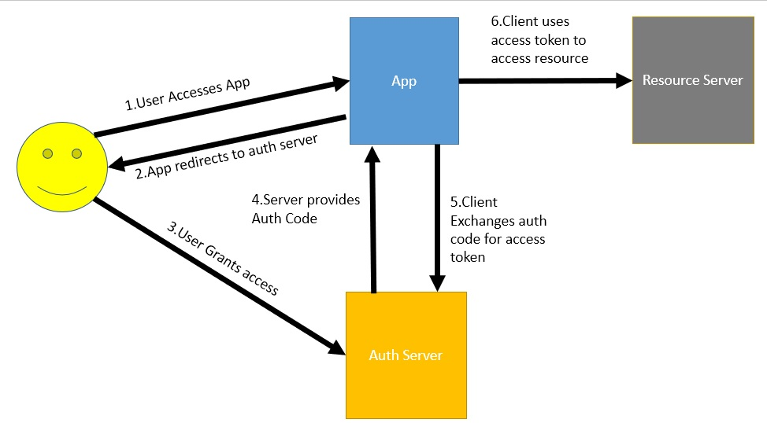
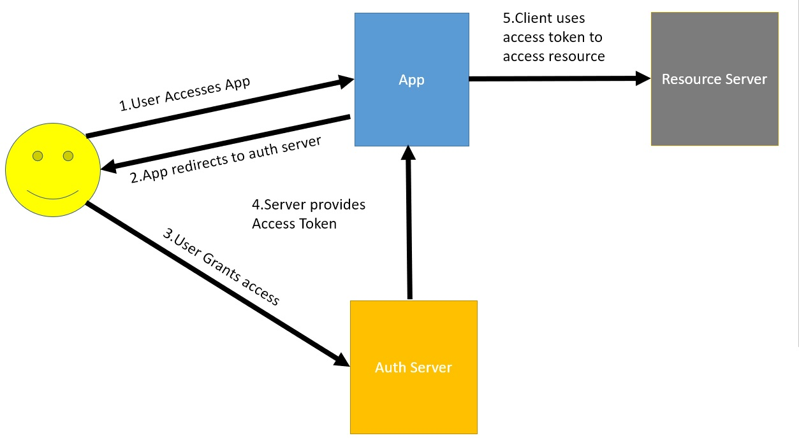
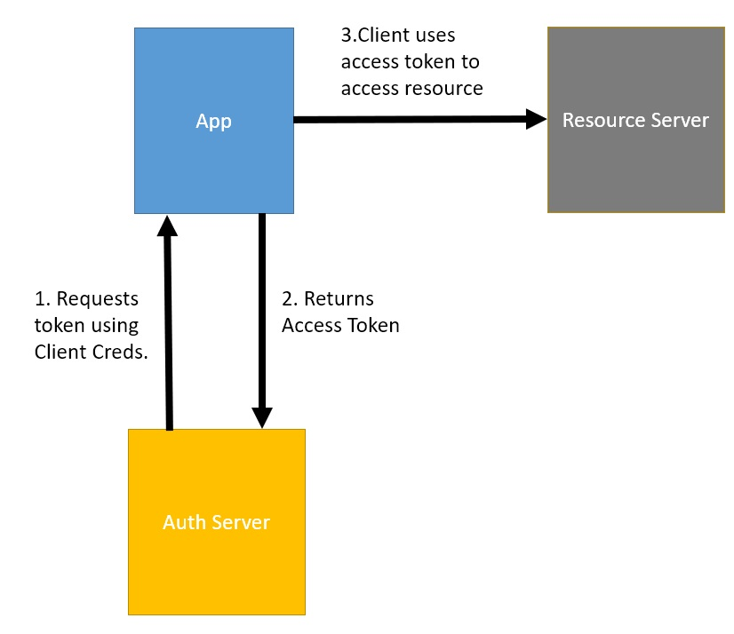

# OAuth
- Authorization framework


## OAuth Terminologies
- Resource Owner
  - User who owns the resources
  - Eg. Facebook User
- Client
  - 3rd party Application which is  tryting to access Users Resources.
  - Eg. Some kind of dating app which need access to your photos on FB.
- Resource Server
  - A server where user has its resources.
  - Eg. Facebook
- Authorization Server
  - Eg. FB's Authorization server.(OAuth Server) 
- Authorization Grant
  - An authorization grant is a credential representing the resource owner’s authorization (to access its protected resources) used by the client to obtain an access token. The OAuth specification defines four grant types, which we will discuss in the upcoming lessons.  
- Authorization code
  -  In some OAuth flows, the authorization server does not give the access token directly. It first issues an authorization grant. The client then sends this grant with the client secret (more on this later) to the authorization server. After this, the authorization server gives access token to the client. 
- Access Token
  - Access tokens are credentials used to access protected resources. An access token is a string representing an authorization issued to the client. Tokens represent specific scopes and durations of access, granted by the resource owner, and enforced by the resource server and authorization server. 

## Grant Type
### What is grant type ?
- The way application gets access token
- Each grant type is optimized for particular use
  - Eg. Web app, Native app , server to server apps.
## Types
- Authorization code Grant type
- Implicit Grant Type
- Client Credentials Grant Types
- Resource Owner Grant Type
- Refresh Token Grant type.
### 1. Authorization code Grant type
- The Authorization Code grant type is the most commonly used OAuth 2.0 grant type.
- Used by Web apps and Native apps to get access token from auth server.
- Suitable for Websites and Mobile apps that have backend.
#### Steps 
1. Authorization request
- Client app redirects resource owner (user) to the authorization server's authorization endpoint.
- It sends a set of query aprameters to Identify client app and its intent
  - Query Parameters
  - __response_type__ parameter defines what is the type of response that is expected. __code__ is authorization code
  - __client_id__ ID that idenitifies the client with authorization server.
  - __redirect_uri__ URI where the authorization server redirect to once it has finished interacting with the resource owner.
  - __scope__ resources to which the access is being requested ,(not mandatory) In not provided default scope.
  - __state__ Random String generated and includes it in the request.
- __Request Example__
```
https://authorization.praveen.thumma.com/authorize
?response_type=code
&client_id=1234597
&redirect_uri=https://client.praveen.com/callback
&scope=images_rw
&state=fdser
```
2. Authorization response
- User provides consent to the Auth Server
- Auth Server redirects to the redirect_uri
- AUth Server sends the following parameters.
  - __code__ Authorization code __(Short lived)__ bound to some of the request parameters sent in the request
  - __state__ The string that is passed in the request.
- __Response Example__
```
https://authorization.praveen.thumma.com/callback
?code=djahlkjdalsdlasdjlnnnjasdhkjasdlk
&state=fdser
```
3. Token Request

```
POST /token/endpoint HTTP/1.1

  Host: authserver.praveen.com

grant_type=authorization_code
&code=djahlkjdalsdlasdjlnnnjasdhkjasdlk
&client_id=1234597
&client_secret=tgsjahsjkdka765asdkhalsds
```
5. Token Response

```
HTTP/1.1 200 OK
Content-Type: application/json

{
  "access_token":"dahjsdhlahsdlalsdlhalsdhljahsG",
  "token_type":"bearer",
  "expires_in":3600,
  "refresh_token":"GHTYAJHJKLSHALHLSHAJHSJLA",
  "scope":"images_rw"
}
```



## 2. Implicit grant type
- Designed for SPA Java apps that __do not have backend__
- JS apps w/o backend have no secure way to store client secrets.
- In implicit flow Auth server returns acces token instead of returning authorization code.
### Steps
1. Authorization Request
- Similar to Authorization Grant flow
- Query Parameters
  - __response_type__ this will be token instead of code as in the earlier grant type.
    - We wont be requesting authorization code from auth server 
    - We will be asking for token.
  - __client_id__ ID that idenitifies the client with authorization server.
  - __redirect_uri__ URI where the authorization server redirect to once it has finished interacting with the resource owner.
  - __scope__ resources to which the access is being requested ,(not mandatory) In not provided default scope.
  - __state__ Random String generated and includes it in the request.
 
 ```
 https://authorization.server.praveen.com/authorize
?response_type=token
&client_id=12345
&redirect_uri=https://client.praveen.com/callback
&scope=images.read
&state=abcde
 ```
 2. Authorization Response
- User provides consent to the Auth Server
- Auth Server redirects to the redirect_uri
- AUth Server sends the following parameters.
  - __access_token__ Authorization code __(Short lived)__ bound to some of the request parameters sent in the request
  - __state__ The string that is passed in the request.
- The token is returned in the URL fragment instead of in the query string 
- __Response Example__
```
https://authorization.server.praveen.com/callback
#access_token=hhdf6hsbhjG66hgtgfGGHJGCHJ
&token_type=bearer
&expires_in=500
&state=abcde
```
- The expiration time of this token is kept a little less because this flow is not safe.




## 3. Client Credentials Grant Type.
- Machine to Machine Authorization
- No User Involved
- Used in Microservcie Environment

### Steps
1. Token Request
- Since no user is involved, the client directly sends an HTTP Post request to the authorization server.
- Query Parameters
  - __grant_type__ Since we are requesting the access token using the client credentials, this parameter will contain __client_credentials__
  -  __client_id__ Client ID of the app
  -  __client_secret__ The client secret of the app.
  -  __scope__ The optional parameter defining the resources being requested.
  
 - Request
 ```
 POST /token/endpoint HTTP/1.1

  Host: authserver.praveen.com

grant_type=client_credentials
&client_id=12345
&client_secret=gh5Gdkj743HFG45udbfGfs
&scope=images_read
 ```
2. Token response
- If client credentials are valid , a token is returned by the Auth Server.
- response
```
HTTP/1.1 200 OK
Content-Type: application/json

{
  "access_token":"shdjlahsjldhkasdjkasduuyuyausydu",
  "token_type":"bearer",
  "expires_in":3600,
  "refresh_token":"hasdjahksdhjkahsdjkhasjkdh",
  "scope":"images_read"
}
```




## 4. Resource Owner Credential Grant.
- Used when resource trusts the client and ready to sahre credentials with the client.
- Only allow it when other flows are not viable.
- This flow was introduced to migrate existing clients using direct authentication schemes such as HTTP Basic or Digest authentication to OAuth by converting the stored credentials to an access token. Today, there is no case in which this flow should be used, as it is very insecure.

### Steps
1. __Token Request__
- Client collects the credentials from the user and sends a POST request to the authorization server
- Query Parameters
  -  __response_type:__ The value for this flow is “password”.
  - __client_id:__ The client id.
  - __client_secret:__ The client secret.
  - __username:__ The username of the user.
  - __password:__ The user password.
  - __scope:__ Defines the resources to be accessed.
 
 - request
```
POST /token/endpoint HTTP/1.1

  Host: authserver.praveen.com

grant_type=password
&client_id=12345
&client_secret=gh5Gdkj743HFG45udbfGfs
&username=Jone@xyz.com
&password=abcde
&scope=images_read
```

2. __Token response__
- If credentials are correct a token is returned by auth server.
- Response
```
HTTP/1.1 200 OK
Content-Type: application/json

{
  "access_token":"YT3774ghsghdj6t4GJT5hd",
  "token_type":"bearer",
  "expires_in":3600,
  "refresh_token":"YT768475hjsdbhdgby6434hdh",
  "scope":"images_read"
}

```
